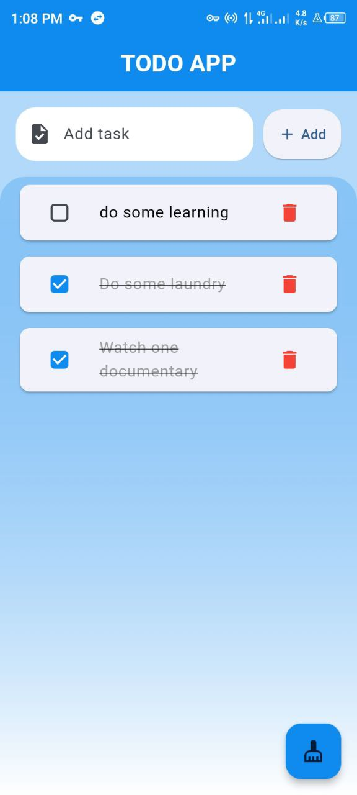
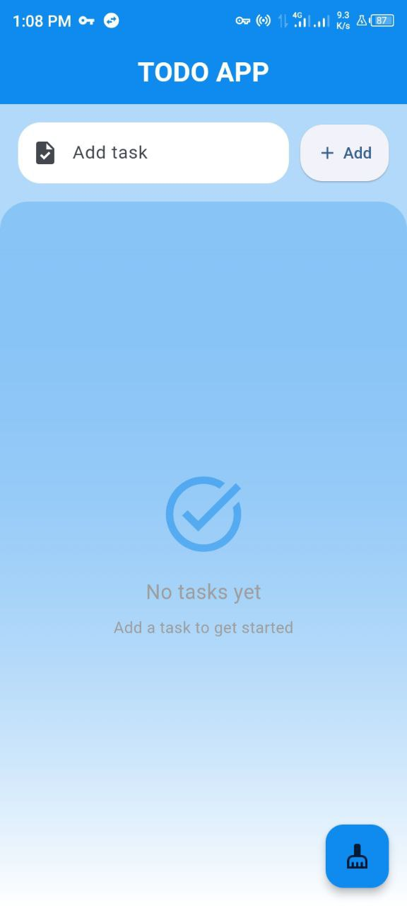

# TODO App

A simple, intuitive Flutter-based TODO application that allows users to manage their tasks effectively. The app supports task creation, deletion, and marking tasks as completed, with persistent storage for saving tasks locally.

---

## Features

- **Add Tasks**: Quickly add new tasks using an input field and a submit button.
- **Mark Task as Completed**: Toggle task completion status with a checkbox.
- **Delete Tasks**: Swipe to delete tasks or use a delete button.
- **Persistent Storage**: Saves tasks locally on the device using JSON file storage.
- **Clear Completed Tasks**: Remove all completed tasks in one click.
- **Responsive UI**: Smooth and modern design with animations and gradients.

---

## Screenshots

### Task List


### Add Task



---

## Getting Started

### Prerequisites

- Flutter SDK installed. [Follow Flutter installation guide](https://docs.flutter.dev/get-started/install).
- A working IDE (e.g., Visual Studio Code or Android Studio).

### Installation

1. Clone the repository:
   ```bash
   git clone https://github.com/wambugu71/todoapp.git
   cd todoapp
   ```

2. Run `flutter pub get` to install dependencies.

3. Build and run the app:
   ```bash
   flutter run
   ```

---

## Code Structure

### Task Model

The `Task` class represents a single task and includes methods for JSON serialization and deserialization:

```dart
class Task {
  String title;
  bool isCompleted;

  Task({required this.title, this.isCompleted = false});

  Map<String, dynamic> toJson();
  factory Task.fromJson(Map<String, dynamic> json);
}
```

### Persistent Storage

- Tasks are saved to and loaded from a JSON file stored in the device's local storage.
- The `path_provider` package is used to access the application documents directory.

### Main Components

1. **Task List**: Displays a list of tasks using `ListView`.
2. **Task Input**: A `TextField` for entering new tasks and a button to add them.
3. **Task Item**: A dismissible card with a checkbox to mark completion and a delete button.

---

## Key Functionalities

### Add New Task
- Input a task title in the provided text field.
- Press the "Add" button or hit "Enter" to insert the task into the list.

### Mark Task as Completed
- Tap the checkbox next to a task to toggle its completion status.

### Delete Task
- Swipe left on a task to delete it.
- Alternatively, use the delete button.

### Clear Completed Tasks
- Click the floating action button to remove all completed tasks.

### Persistent Storage
- Tasks are automatically saved locally whenever they are added, modified, or deleted.

---

## UI Highlights

- **Gradient Backgrounds**: Adds a sleek look to the app.
- **Material Design Components**: Modern UI design following Flutter best practices.
- **Animations**: Smooth transitions and feedback for user actions.

---

## Packages Used

- [flutter/material.dart](https://api.flutter.dev/flutter/material/material-library.html): Core Flutter UI components.
- [path_provider](https://pub.dev/packages/path_provider): Accessing local storage directories.
- [dart:convert](https://api.dart.dev/stable/dart-convert/dart-convert-library.html): JSON encoding and decoding.
- [dart:io](https://api.dart.dev/stable/dart-io/dart-io-library.html): File operations.

---

## How to Contribute

1. Fork the repository.
2. Create a new branch:
   ```bash
   git checkout -b feature/your-feature-name
   ```
3. Commit your changes:
   ```bash
   git commit -m "Add your message here"
   ```
4. Push to the branch:
   ```bash
   git push origin feature/your-feature-name
   ```
5. Open a pull request.

---

## License

This project is licensed under the MIT License. See the [LICENSE](LICENSE) file for details.

---

## Contact

Created by [@wambugu71](https://github.com/wambugu71). Feel free to reach out with any questions or suggestions!

```
